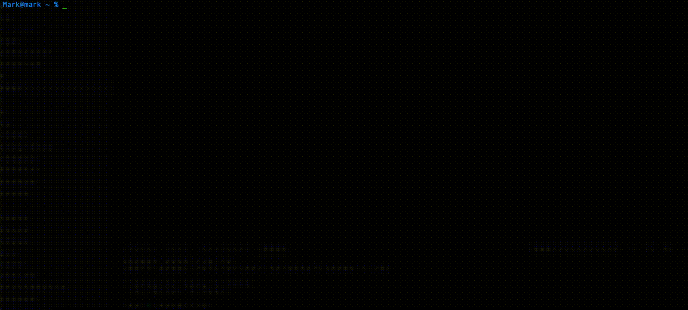

# Reactive Platform Terminal

An example terminal application connecting to the Reactive Platform. It displays the order book, public trades and the bid/offer spread.



## Quick Start

```bash
npm i -g @reactivemarkets/platform-terminal
```

You need to give the terminal an api key to connect. You can either set an environment variable `REACTIVE_PLATFORM_API_KEY` or pass in via the command line arg `api-key`.

To run with an environment variable:

```bash
reactive-terminal
```

or with an api key:

```bash
reactive-terminal --api-key MY_API_KEY
```

## Command Line Usage

For a full list of commands see the built in help:

```bash
reactive-terminal --help
```

## Building

To install all dependencies and build run:

```bash
git clone https://github.com/reactivemarkets/platform-js.git
cd platform-js
npm ci
npm run build
```

## Versioning

We use [SemVer](http://semver.org/) for versioning. For the versions available, see the [tags on
this repository](https://github.com/reactivemarkets/platform-js/tags).

## License

This project is licensed under the Apache 2.0 License - see the [LICENSE](LICENSE) file for
details.
